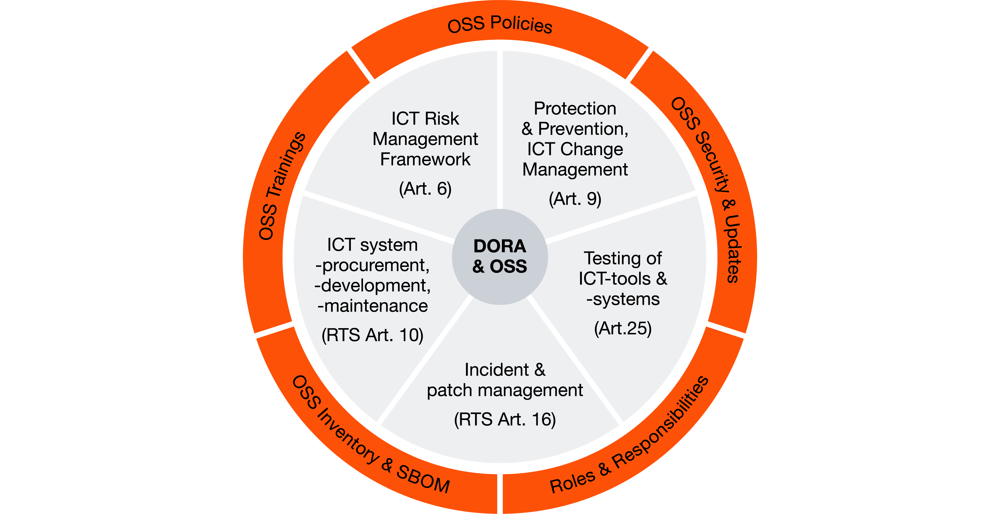

# DORA and OpenChain in Banking sector
## Regulatory risk factors as OpenChain adoption driver
Warsaw, 01.06.2026

---
# About me
**Damian Fajfer**
- Actively involved in free software movement
  - Core Team Member, Poland Coordinator at FSFE
  - Member of the board of Polish Linux User Group
- 6y+ of experience in banking sector (DevSecOps Engineer)

---
# DORA tl;dr

- Articles 10 (Vulnerability and Patch Management)
  - continous vulnerability detection, reporting to the authority
- Article 16 (ICT Systems Acquisition, Development, and Maintenance)
  - whatever the sector buys has to be legit as we're ultimately responsible for the outcome

---
# DORA makes OSS an ICT Risk Factor

DORA forces the sector to manage open source software

- Definition of a risk management framework for FOSS
- Integratin FOSS policies into existing guidelines
- Manage vulnerabilities in the supply chain in automated way

https://www.pwc.de/en/risk-regulatory/risk/dora-and-open-source-digital-resilience-in-the-eu-financial-sector.html

---
# Polish Financial Authority recommendations

KNF 20 anniversary motto "strong supervision, safe market"

- Already aligned their recommendations with DORA
- Stronger enforcement (best-effort/suggestions vs clear requirements) compared to previous KNF recommendations

---
# Why OpenChain?

- Tooling support for a mature standard
- Clear guidelines for both vendors and clients
  - Banks are responsible for their third-party vendors
- Proving the regulator we're going above and beyond
  - potentially helping the regulator in that field
- Potential benchmark supremacy when this starts being a metric

---
# Why not OpenChain?

Potential arguments from the sector
- OWASP Top 10 Risks for Open Source Software
- "It's just the SBOMs"
- "We're not developing OSS"

---
# Thank you

- How to make the argument stronger?
- How do you promote OpenChain locally?